#  Golf Tournament REST API

This project is a **Spring Boot REST API** built for managing **golf club members and tournaments**. It supports creating, retrieving, and searching for both members and tournaments, with full integration to a relational database and Docker support.

---

## Features

### Members

- Add a new member
- Get all members
- Search members by:
    - Name
    - Membership Type
    - Phone Number
    - Tournament Start Date

### Tournaments

- Add a new tournament (with list of participating member IDs)
- Get all tournaments
- Get tournament by ID
- Search tournaments by:
    - Start Date
    - Location
- Get all members participating in a tournament

---

## Technologies Used

- Java 21
- Spring Boot
- Spring Data JPA
- MySQL (Local and RDS-ready)
- Docker & Docker Compose
- Postman (for API testing)

---

## Database Schema

### Member

| Field              | Type    |
|-------------------|---------|
| id (auto)          | Long    |
| name               | String  |
| address            | String  |
| email              | String  |
| phoneNumber        | String  |
| membershipStart    | LocalDate |
| membershipDuration | Integer |

### Tournament

| Field              | Type    |
|-------------------|---------|
| id (auto)          | Long    |
| startDate          | LocalDate |
| endDate            | LocalDate |
| location           | String  |
| entryFee           | Double  |
| prizeAmount        | Double  |
| participatingMembers | List<Member> |

---

## API Endpoints

### Member Endpoints

| Method | Endpoint                                     | Description                             |
| ------ | -------------------------------------------- | --------------------------------------- |
| POST   | `/members`                                   | Add a new member                        |
| GET    | `/members`                                   | Get all members                         |
| GET    | `/members/search/name?name=John`             | Search members by name                  |
| GET    | `/members/search/type?type=Gold`             | Search by membership type               |
| GET    | `/members/search/phone?phone=1234567890`     | Search by phone number                  |
| GET    | `/members/search/tournament?date=2024-08-10` | Search members by tournament start date |

### Tournament Endpoints

| Method | Endpoint                                         | Description                          |
| ------ | ------------------------------------------------ | ------------------------------------ |
| POST   | `/tournaments`                                   | Add a new tournament with member IDs |
| GET    | `/tournaments`                                   | Get all tournaments                  |
| GET    | `/tournaments/search/start-date?date=2024-08-10` | Search by start date                 |
| GET    | `/tournaments/search/location?location=Toronto`  | Search by location                   |
| GET    | `/tournaments/{id}/members`                      | Get all members in a tournament      |

---


## Running with Docker

### Step 1: Build the App
```
mvn clean package
```
### Step 2: Build Docker Image
```
docker build -t golf_tournament_api:latest .
```

### Step 3: Run with Docker Compose
```
docker-compose up
```

### Step 4: Tag your image
```
 docker tag golf_tournament_api:latest walidjer/golf_tournament_api:latest

```

### Step 5: Push the image to Docker Hub
```
 docker push walidjer/golf_tournament_api:latest

```

OR 
Simply Use this image in docker-compose.yml
```yaml
image: walidjer/golf_tournament_api:latest
```
## Postman Testing Screenshots
### Note: 
All API tests were executed both before and after containerizing the application with Docker. In both cases, the results were consistent and successful.
### POST /members
URL: http://localhost:8080/members


### POST /tournaments
URL: http://localhost:8080/tournaments


### Get all members
Method: GET
URL: /members

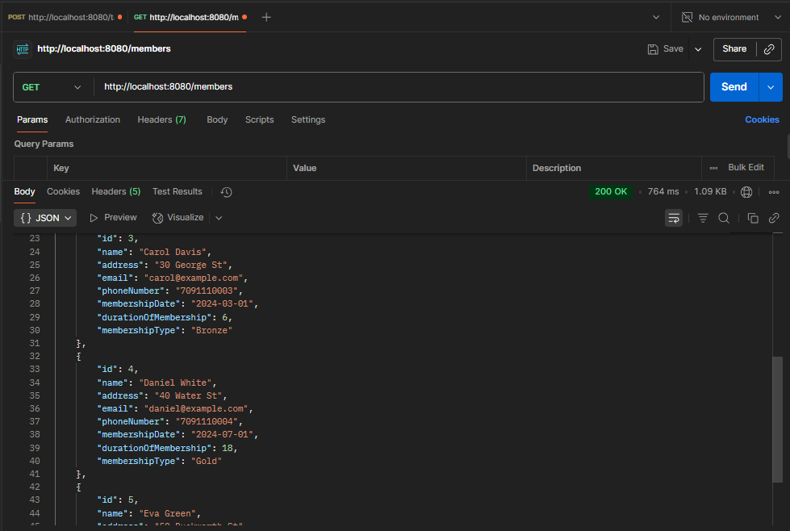

### Get all tournamentss
Method: GET
URL: /tournaments

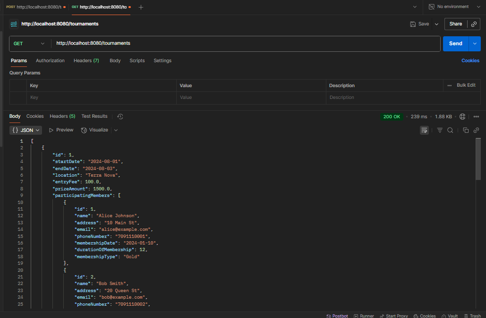

### Search member by name
Method: GET
URL: /members/search/name?name=Alice Johnson


### Search members by membership type
Method: GET
URL: /members/search/membership-type?type=Gold

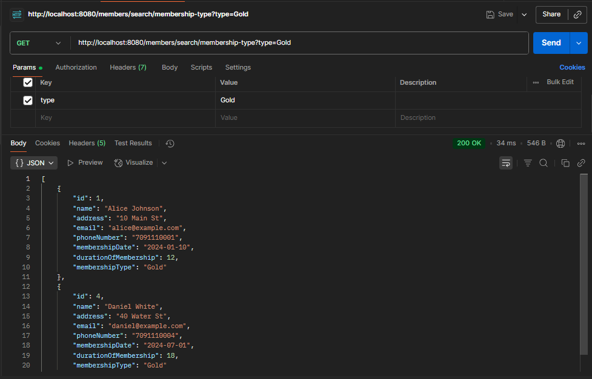

### Search member by phone number
Method: GET

URL: /members/search/phone?phone=7091110001


### Search members by tournament start date
Method: GET
URL: /members/search/tournament-date?date=2024-08-01
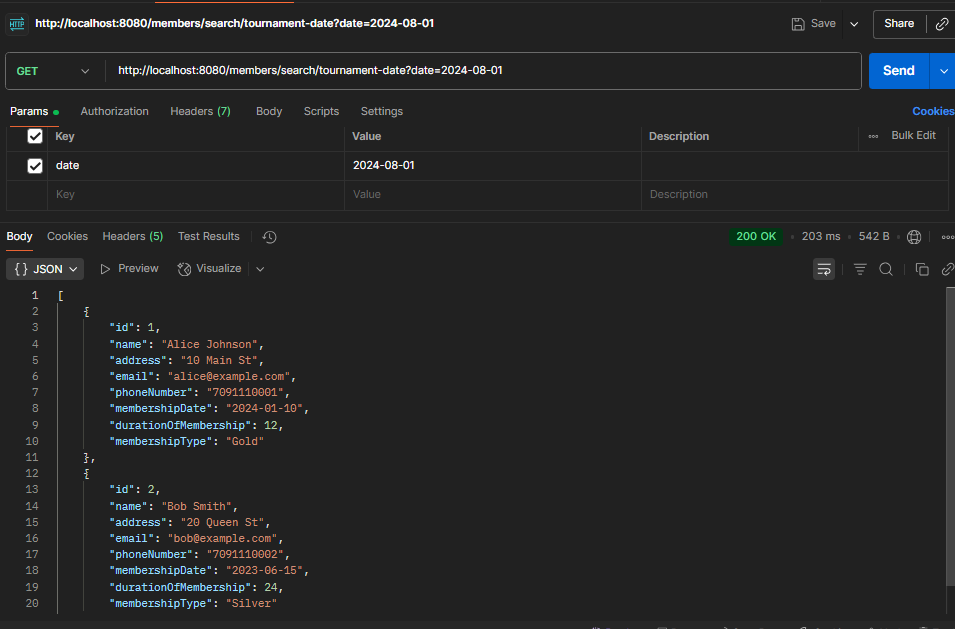

### Search tournaments by start date
Method: GET
URL: /tournaments/search/start-date?date=2024-08-01


### Search tournaments by location
Method: GET
URL: /tournaments/search/location?location=Clovelly


### Get members in a tournament
Method: GET
URL: /tournaments/{id}/members
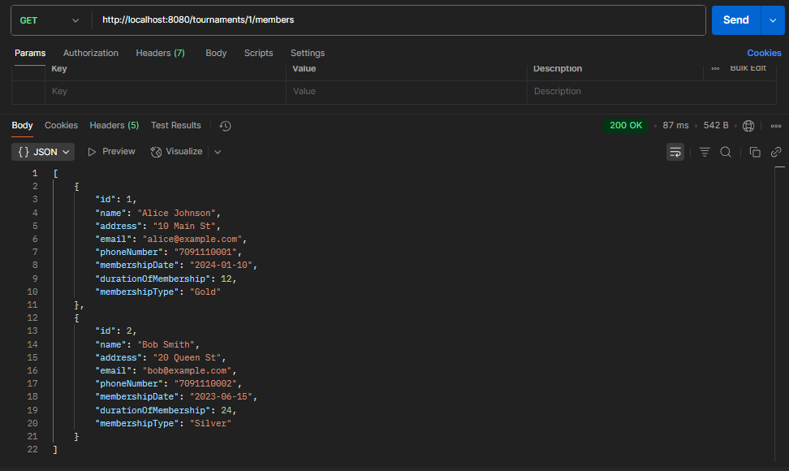


## Docker Image Screenshot
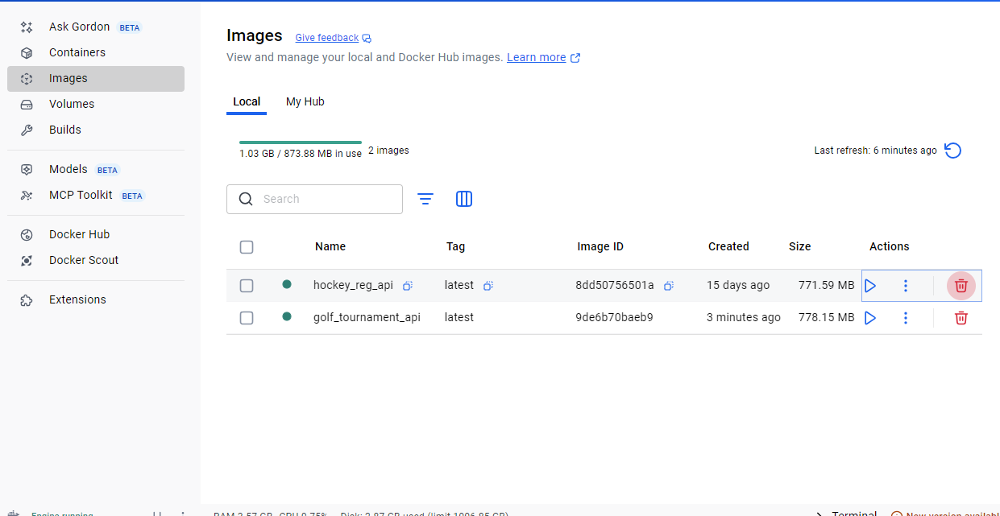

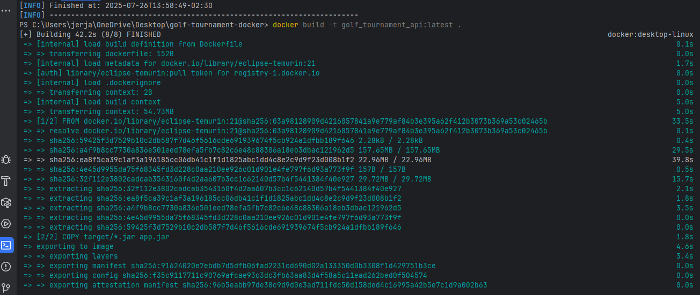

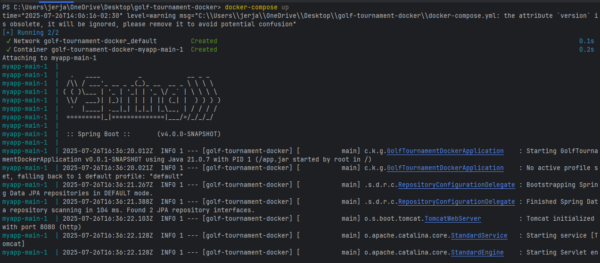

### Docker Hub Screenshot

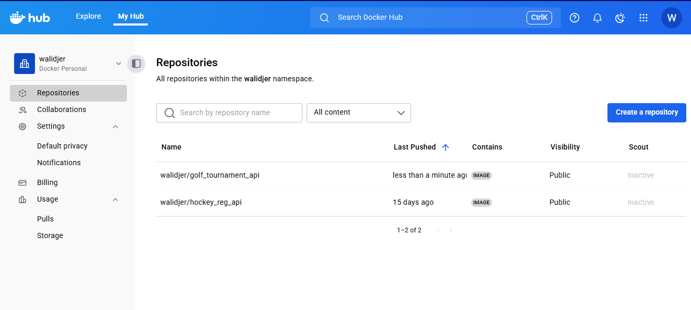

## AWS RDS Integration

### Step-by-Step AWS Console Configuration:

1. **Log into the AWS Console** and navigate to the **RDS** service.
2. Click **Create Database**.
3. Choose:
  - **Standard Create**
  - **MySQL**
 
4. Fill in:
  - DB instance identifier: `golf-tournament-db`
  - Master username: `admin`
  - Master password: `Your password`
5. Under **Connectivity**:
  - Set **Public access** to **Yes**
  - Enable automatic port: `3306`
  - In **VPC security groups**, ensure your IP is added to allow access (port 3306)
6. Click **Create database** and wait until status is **Available**
7. Copy the **Endpoint** from the RDS instance summary (e.g. `golf-tournament-db-instance-1.cg99fuzej1dr.us-east-1.rds.amazonaws.com`)

### Update `docker-compose.yml`
```yaml
version: '3'
services:
  myapp-main:
    image: golf_tournament_api:latest
    ports:
      - 8080:8080
    environment:
      - spring.datasource.url=jdbc:mysql://golf-tournament-db-instance-1.cg99fuzej1dr.us-east-1.rds.amazonaws.com/golf_tournament
      - spring.datasource.username=admin
      - spring.datasource.password=Password


```
Redeploy Steps
```
docker-compose down
mvn clean package
docker build -t golf_tournament_api:latest .
docker-compose up
```

## RDS Integration Testing
### AWS RDS Configuration Screenshot
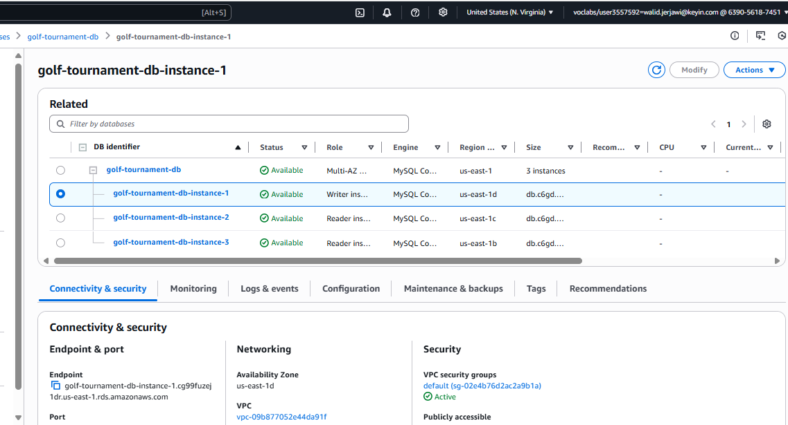
### Postman Test (POST)
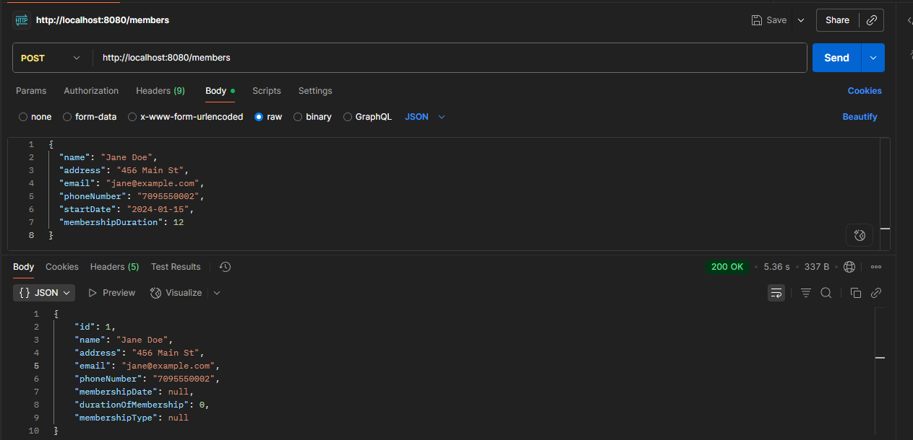

### MySQL Workbench Query on RDS
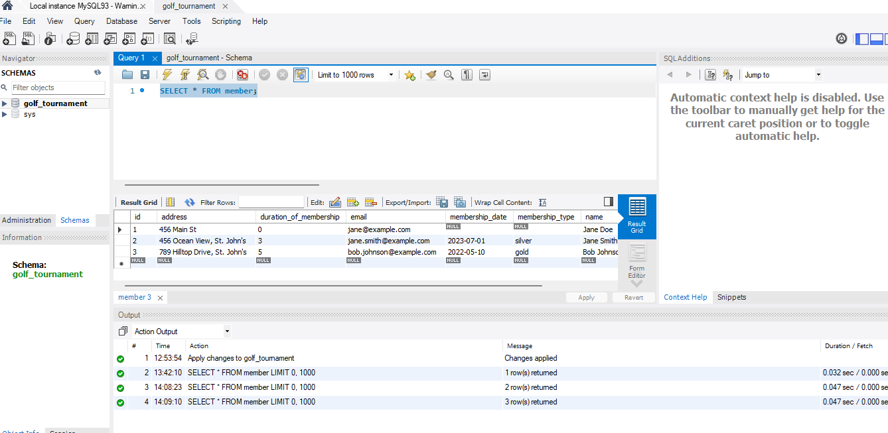

---

## Deploying on AWS EC2

### Step-by-Step Guide:

1. **Launch EC2 Instance**
  - Go to AWS Console > EC2 > Launch Instance.
  - Choose Amazon Linux 2 or Ubuntu (x86_64 or ARM).
  - Choose a security group with port `22` (SSH) and `8080` (HTTP) open to your IP or `0.0.0.0/0` for testing.
2. **Connect to the Instance**
3. **Install Docker**
```bash
 sudo yum update -y
 sudo yum install docker -y
 sudo usermod -aG docker ec2-user
 id ec2-user  # confirm docker group added
 newgrp docker  # apply docker group without logout
 sudo systemctl enable docker.service
 sudo systemctl start docker.service
 sudo systemctl status docker.service
```

4. **Login to DockerHub**
```bash
docker login
# Username: walidjer
# Password: <DockerHub password>
```

5. **Pull and Run the Image**
```bash
docker pull walidjer/golf_tournament_api:latest
# Run the container on port 8080
docker run -it -p 80:8080 walidjer/golf_tournament_api:latest
```

**EC2 Docker Pull Screenshot**
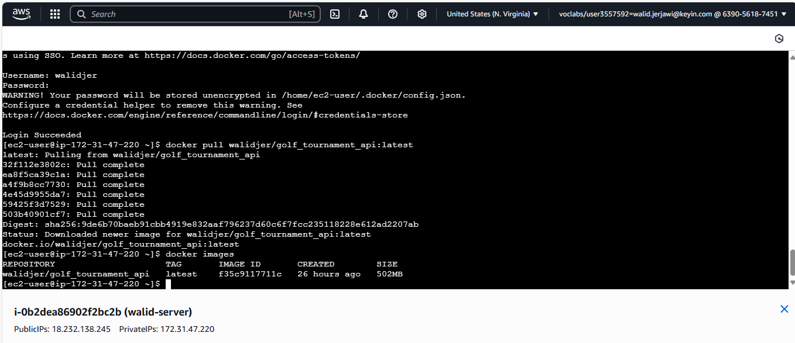

**EC2 Running Container Screenshot**
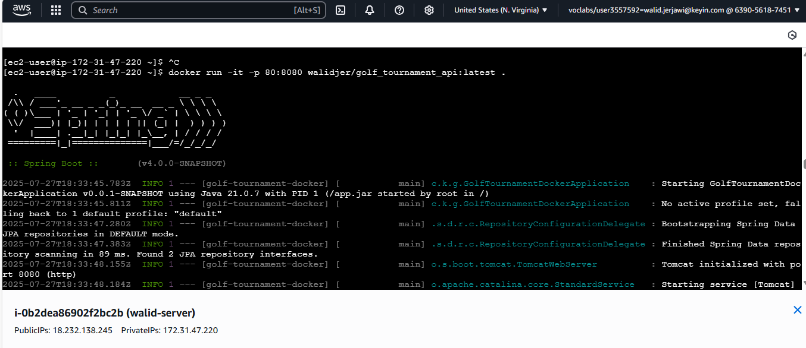
